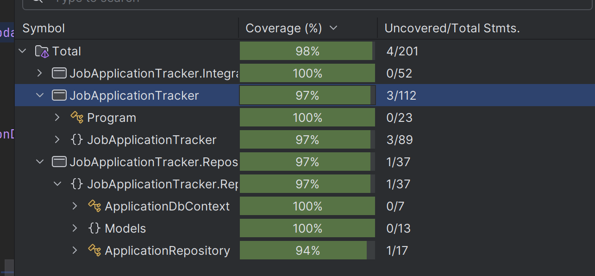
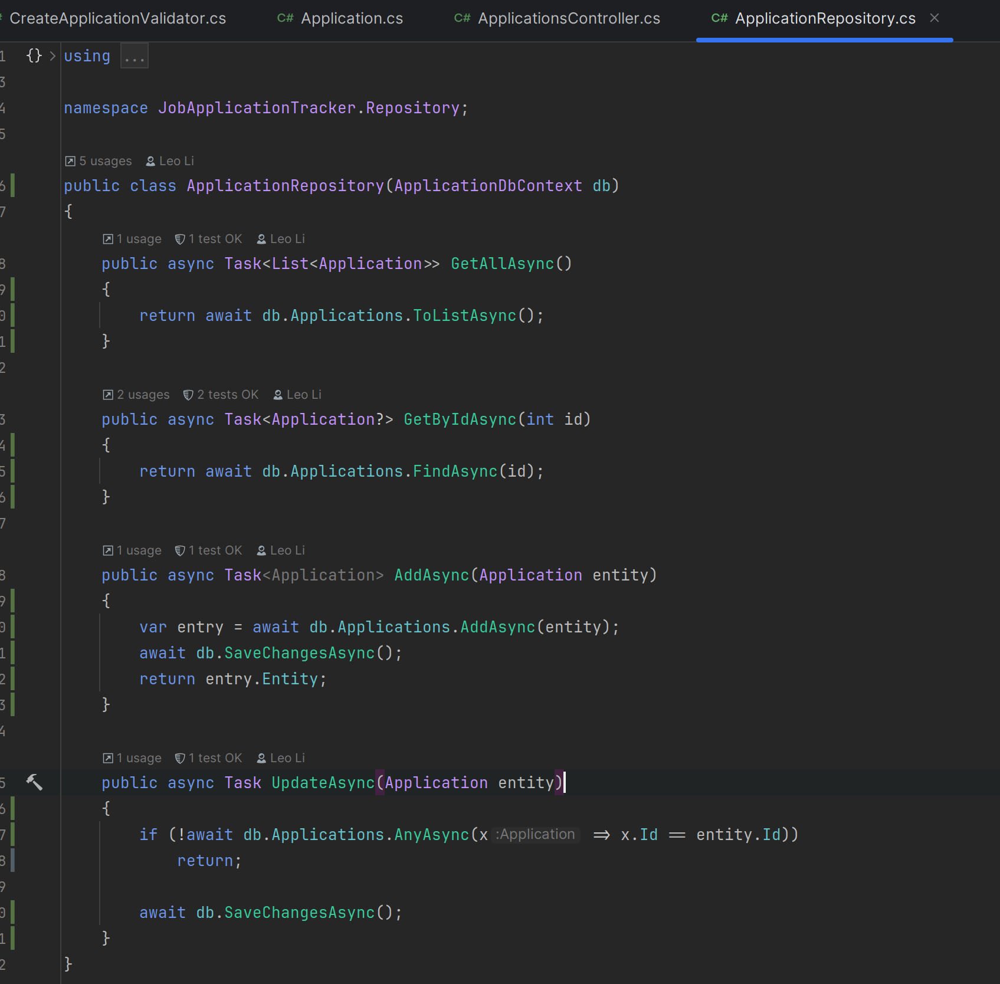
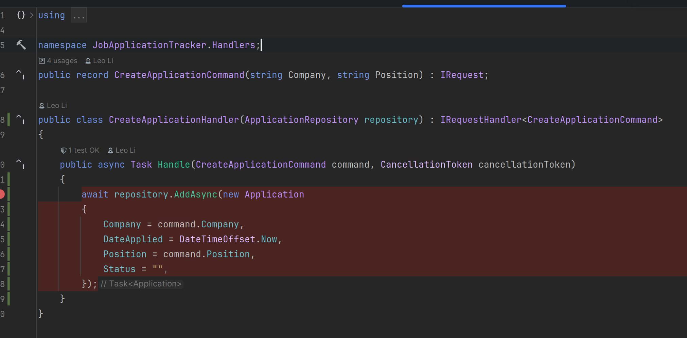
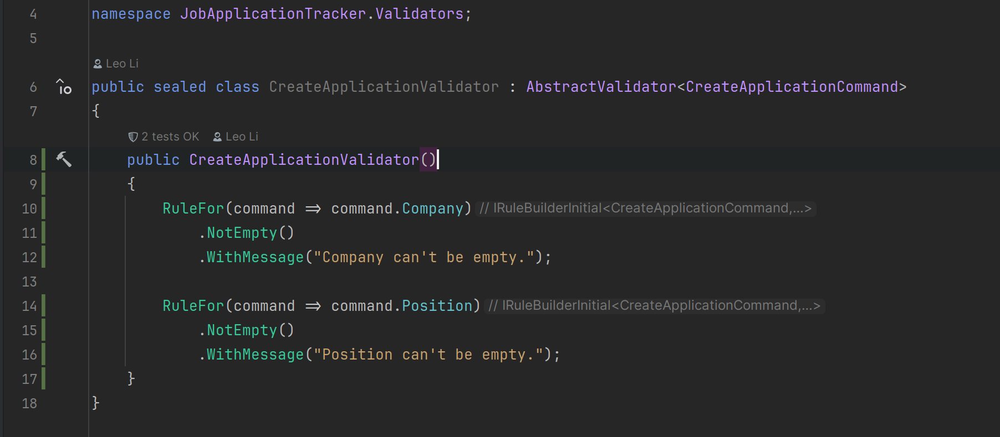
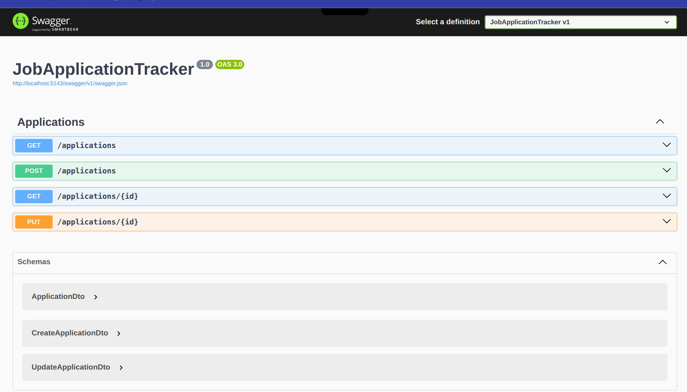
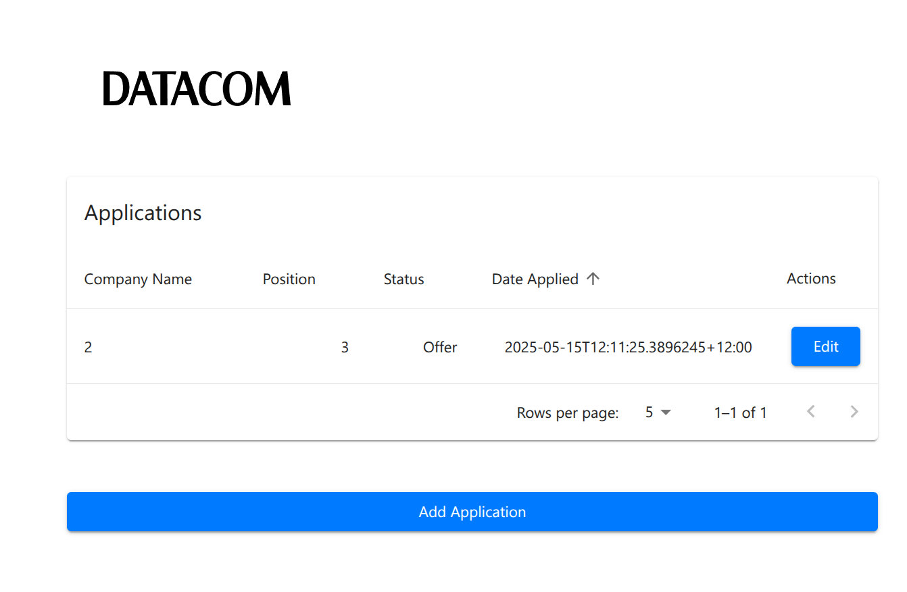
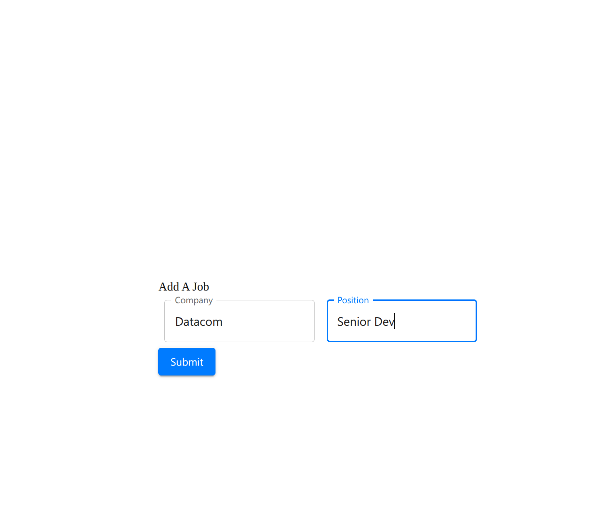
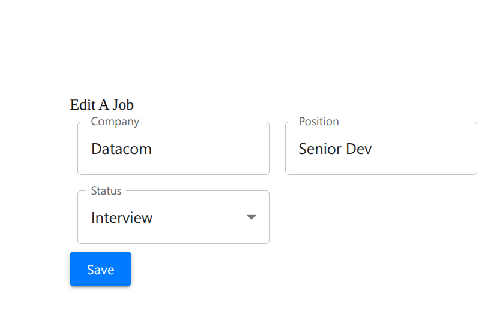

## Installation

```sh
pnpm i
```

### Running the Frontend (Next.js)

```sh
pnpm dev
```

### Running the Backend (.Net Core 8)

```sh
dotnet run --project backend/JobApplicationTracker/JobApplicationTracker.csproj
```

## Frontend:

-  `Next.js`

   The new go-to framework for React. It has a lot of features like server-side rendering, static site generation.

-  `react-query`

    It solves the problem of data fetching, race condition and caching in React applications.

-  `react-hook-form`
    
    It helps to manage form state and validation.

-  `turbo repo`

    Turbo repo makes it easier to share code between different apps

-  `Material UI`

    It looks sleek. And it's good if we don't have UI designer.

-  `axios`


## Backend:
- Code Coverage: `97%`

  I wrote integration tests for the API one endpoint at a time. Used `FluentAssertions` for assertions.



- `Repository Pattern`.

  We can mock the implementation if needed. (for now, I just used in-memory database for testing)



- `MediatR` along with `FluentValidation` for validation.




- `swagger`



- Screenshots




### Folder structure

```bash
├── backend                   
│   ├── JobApplicationTracker                   # .Net Core API
│   └── JobApplicationTracker.IntegrationTests  # Backend Integration Tests
|   └── JobApplicationTracker.Repository        # Repository Folder
├── apps                                        # Frontend Apps
│   ├── web
│   │   ├── app
│   │       └── job                             # The Add Job Application Page
│   │           └── [id]                        # The Edit Job Application Page
├── packages                                    # Shared Packages
│   ├── ui                                      # Shared UI Components
```
